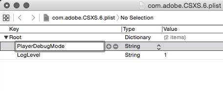
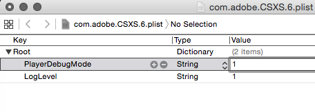

# hanpuku #

Hanpuku is an interface between d3.js and Adobe Illustrator, enabling a more flexible
data visualization workflow. Data bindings no longer disappear when you edit a d3-generated
graphic in Illustrator; those bindings now survive custom edits, and even
get saved inside native .ai files.

On the flip side, your custom Illustrator edits
will also survive properly-written d3.js scripts: now, when your data changes after
you've done lots of hand-crafted awesomeness, you don't have to start over from scratch!

Another cool addition is that Illustrator and d3.js selections are merged; you can now
set attributes for stuff you have selected in Illustrator like a normal d3.js selection. You can
even filter the current Illustrator selection based on data, or perform complex selections right from
the code!

Installation
------------
<i style="color:#e7298a">Adobe has discontinued their Extension Manager, so you may encounter difficulties installing the bundled [ZXP extension](http://www.cs.utah.edu/~abigelow/Downloads/hanpuku/hanpuku.0.1.8.zxp) directly. Until I find time to roll my own installer, you can install Hanpuku following these instructions on OS X (let me know if you have problems on Windows... I haven't gotten a chance to test the extension there):</i>

#### Step 1
With Illustrator closed, open the terminal and type or paste these commands:

```
cd ~/Library/Application\ Support/Adobe/
mkdir CEP
mkdir CEP/extensions
cd CEP/extensions
git clone https://github.com/alex-r-bigelow/hanpuku.git
```

If you don't have git installed on your system, you can download the [zipped source code](https://github.com/alex-r-bigelow/hanpuku/archive/master.zip), extract it, and type this instead of the last line:
```
mv ~/Downloads/hanpuku-master ~/Library/Application\ Support/Adobe/CEP/extensions/hanpuku
```

#### Step 2
Illustrator won't normally load the extension unless it's cryptographically signed. The old Extension Manager way of installing handled this for you, but until we get a better fix, you'll have to disable this check.

Open `~/Library/Preferences/com.adobe.CSXS.6.plist`

Add a row with key `PlayerDebugMode` of type String:



Set its value to 1:



#### Step 3
You should now be able to launch Illustrator and open the Hanpuku extension window.


See Hanpuku in action:
----------------------

[Infovis 2016 Submission Video](https://www.youtube.com/watch?v=eNoDZcs7vVs)

More videos:
------------

[Streamgraph example](https://www.youtube.com/watch?v=uYQ-RLT5AVA)

[Les Miserables demo](https://www.youtube.com/watch?v=BBY0-AopdQ8)

[Tweaking the geometry of a node](http://youtu.be/xuBMgR6ElR4)

[Importing an example from bl.ocks.org](http://youtu.be/41P-h6e8OcI)


Work in progress:
-----------------
#### Crazy ideas to explore
- Sync with Chrome dev tools (create a Hanpuku Chrome extension for smooth two-way transitions?)
- Add better, cleaner import / export / copy / paste features for full HTML or SVG snippets
  - Provide more user control about what gets imported / exported / copied / pasted:
    - Options to handle CSS rules that apply to snippets (but the rules themselves may live off in a stylesheet somewhere)?
    - Options to control whether / how D3 bindings, event bindings, and other javascript properties that aren't in the HTML can be preserved
      - (does any of this change with Illustrator's new-ish, yet still freakishly limiting variable / "graph" data binding approaches? Is there a better way to integrate?)
    - Other options besides my mandatory SVG element = Illustrator artboard interpretation
    - Controls to preserve rects as rects instead of converting everything to paths all the time?
    - Text conversion issues are extremely messy internally - I should probably expose these issues rather than impose them myself

#### Known bugs
- Text rotation / scale bugs
- Links to Swatch colors are lost (need to do a true diff model...?)
- Arc approximation irregularities
- Duplicate path endpoints
- Need to turn off perspective grid or isolation mode temporarily (if they're on) in domToDoc, or stuff dies (how to do this with jsx?)

#### High priority
- Replace textareas with ace editors, better file saving / organization / syncing
- Better font support
- Bitmap support
- Gradient support
- Mask support
- Symbol support
- Stroke properties (dashes, caps, etc.)

#### Medium priority
- Regex search/replace in text editors (esp. data)
- Circular data in the Data preview (visualize cycles)
- More examples
- Proper CMYK color
- Export as/to web page
- Add some kind of placeholder in each environment for unsupported items like blends/graphs, or videos/form elements?

#### Low priority
- Implement non-programmer UX
- Embed the Chrome debugging window as a view
- Embed data, js, css files inside the .ai file (preserve layer-level properties while I'm at it)
- Load multiple js, css files, distinguish between js libraries and scripts (run the former immediately)

#### Very low priority
- Investigate what it would take to make an Inkscape clone / make Hanpuku an independent application
- Test on Windows
- Tangelo integration / streaming data support